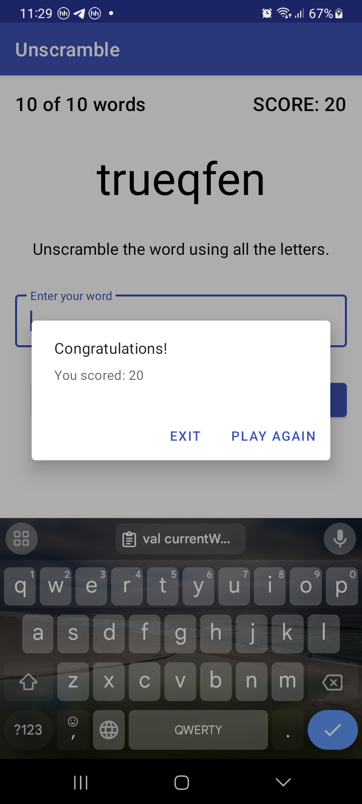

Unscramble Game
===================================

Unscramble is  a single player game app that displays scrambled words. To play the game, player has
to guess the word using all the letters from the displayed scrambled word. Demonstrates usage of **ViewModels** to store app data through configuration changes.
 
Game Fragment observes state holders in the ViewModel and updates UI when data in ViewModel is updated .

